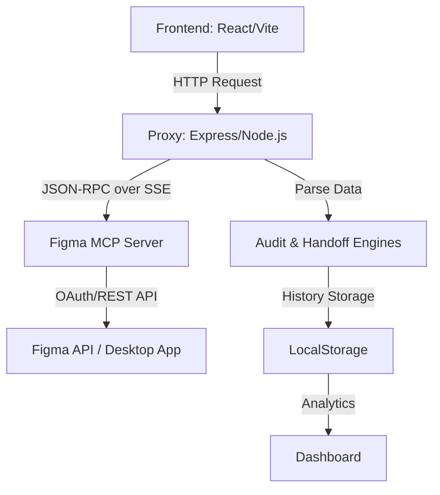

# DS Auditor: Guia de Arquitetura e Funcionamento

Este documento descreve detalhadamente o funcionamento do **DS Auditor**, uma ferramenta de governança de Design System que automatiza a fiscalização de arquivos do Figma.

## 🏗️ Visão Geral do Sistema

O sistema é composto por três camadas principais que trabalham de forma síncrona:

---

## 🚀 Funcionalidades Principais

1.  **Auditoria de Design System (Core)**:
    *   **Cores e Tipografia**: Validação contra tokens semânticos e paleta primitiva.
    *   **Espaçamento e Raios**: Verificação de grid de 8px e escala de border-radius (0, 4, 8, 16, 9999).
    *   **Nomenclatura**: Fiscalização de padrão PascalCase para frames e bloqueio de nomes genéricos.
2.  **Handoff Dev Mode**:
    *   **As 5 Verdades**: Estados, Regras, Escopo, Acessibilidade e **Performance de Estrutura**.
    *   **Score DX**: Análise de profundidade de árvore e camadas ocultas para facilitar a implementação.
3.  **Reporting & Analytics**:
    *   **Exportação em Massa**: Geração de PDF único consolidado para jornadas inteiras.
    *   **Dashboard de Saúde**: Visão histórica e KPIs de conformidade global.

---

## 🛠️ Estrutura de Serviços

### 1. Proxy (`server.mjs`)
Atua como ponte entre o navegador e o Figma MCP. Utiliza `fast-xml-parser` para reconstrução robusta da árvore de camadas a partir dos metadados do Figma.

### 2. Motor de Auditoria (`src/services/auditEngine.ts`)
Centraliza as regras do **DS4FUN v1.4.0**. Avalia cada camada do `FigmaNode` e gera a lista de conformidade visual.

### 3. Analisador de Handoff (`src/services/handoffEngine.ts`)
Avalia a qualidade da documentação técnica e a estrutura do arquivo, gerando um documento Markdown automático para o desenvolvedor.

### 4. Persistência e Histórico (`src/services/historyService.ts`)
Gerencia o armazenamento dos resultados no `localStorage`. Esses dados alimentam o **Dashboard** para acompanhamento da evolução da saúde do Design System.

---

## 📐 Vínculo Obrigatório 1:1:1:1

Este projeto obedece rigorosamente à regra de espelhamento:
1.  **Pasta Local**: `C:\Users\sutil\Documents\lib\ds_auditor`
2.  **GitHub Repo**: `romulosutil/ds_auditor`
3.  **GitHub Project**: `@romulosutil Pipe`
4.  **Obsidian Brain**: Sincronização automática via `RULES.md` e `checkpoint.md`.

*Validado via script `npm run verify-mapping`.*

---

## 📋 Como Manter ou Evoluir
Para novos tokens, atualize as constantes em `src/services/auditEngine.ts`. Para novas métricas de dashboard, estenda o `historyService.ts`.

*Gerado em 25/04/2026*
