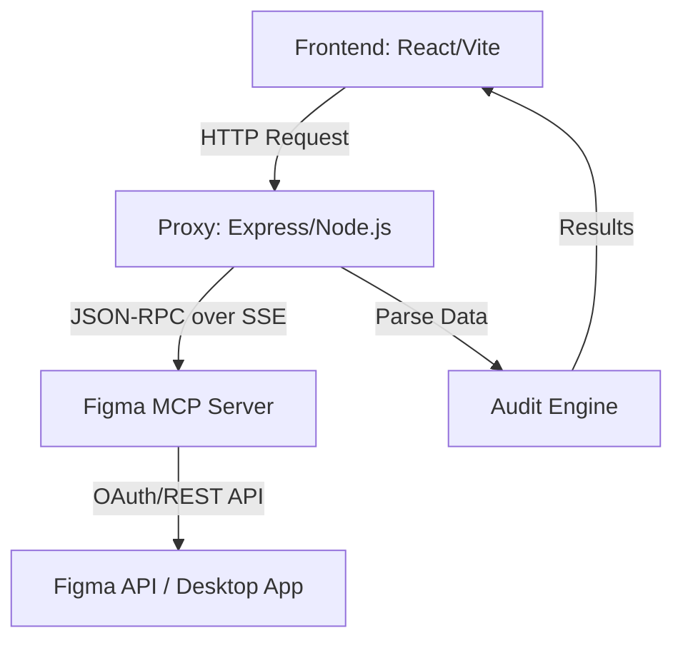

# DS Auditor: Guia de Arquitetura e Funcionamento

Este documento descreve detalhadamente o funcionamento do **DS Auditor**, uma ferramenta de governança de Design System que automatiza a fiscalização de arquivos do Figma.

## 🏗️ Visão Geral do Sistema

O sistema é composto por três camadas principais que trabalham de forma síncrona:

---

## 🚀 Fluxo Passo a Passo

### 1. Entrada do Usuário (Frontend)
O usuário cola a URL de um frame do Figma (ex: `https://figma.com/design/.../?node-id=24:1025`) na barra lateral e clica em **"Iniciar Auditoria"**.

- **Arquivo**: `src/components/Sidebar.tsx`
- **Ação**: Captura a URL e dispara a função `onStartAudit`.

### 2. O Papel do Proxy (`server.mjs`)
Como o navegador não pode se comunicar diretamente com servidores MCP por limitações de segurança e protocolo, o `server.mjs` atua como uma ponte (Bridge).

1. **Protocolo MCP**: O proxy gerencia sessões usando **Server-Sent Events (SSE)** e **JSON-RPC** para falar com o bridge do Figma.
2. **Coleta de Dados**: Ele chama três ferramentas do MCP sequencialmente:
   - `get_metadata`: Obtém a estrutura XML(hierarquia) dos nós.
   - `get_variable_defs`: Extrai todas as variáveis (tokens) associadas ao nó.
   - `get_design_context`: Gera o código React/Tailwind, de onde extraímos valores de `gap` e `padding`.
3. **Reconstrução do Nó**: O proxy combina esses dados em um objeto `FigmaNode` padronizado.

### 3. O Motor de Auditoria (`auditEngine.ts`)
É aqui que a mágica acontece. O motor recebe o `FigmaNode` e aplica um conjunto de regras baseadas no Design System **DS4FUN v1.4.0**:

- **Cores**: Verifica se as cores hexadecimais correspondem aos tokens primitivos ou se variáveis semânticas (ex: `--text-primary`) estão sendo usadas.
- **Tipografia**: Valida se as fontes são apenas *Montserrat* (Títulos) ou *Inter* (Corpo), e se os tamanhos seguem a escala.
- **Espaçamento**: Analisa `gap` e `padding` contra a escala oficial (4, 8, 12, 16, 24, 32, 40, 48px).
- **Raios (Border Radius)**: Permite apenas 8px (interactive), 16px (container) ou 9999px (pill).
- **Nomenclatura**: Fiscaliza se frames e grupos usam *PascalCase* e se instâncias começam com prefixos válidos (ex: `Button/`, `Input/`).

### 4. Cálculo de Score
O motor gera um **Governance Score** de 0 a 100:
- **Erros Críticos**: Penalidade alta (afeta a conformidade direta).
- **Alertas**: Penalidade média (questões de boas práticas).
- **Compliance %**: Percentual de camadas que estão 100% corretas.

### 5. Apresentação e Exportação
O frontend recebe os resultados e os exibe no `MainPanel.tsx`. 
- **PDF**: O projeto utiliza a biblioteca `html2pdf.js` para capturar a área de relatório e converter o HTML em um PDF formatado para impressão, pronto para ser enviado em uma PR ou revisão de design.

---

## 🛠️ Tecnologias Utilizadas

- **Frontend**: React 19, Vite, Tailwind CSS (Design System DS4FUN).
- **Backend**: Node.js, Express.
- **Protocolo**: MCP (Model Context Protocol) para integração com Figma.
- **Ícones**: Lucide React.
- **PDF**: html2pdf.js.

## 📋 Como Manter ou Evoluir
Se o Design System mudar (ex: novos tokens de cor), as alterações devem ser feitas prioritariamente no arquivo `src/services/auditEngine.ts`, onde residem as constantes `DS4FUN_SEMANTIC_TOKENS` e `DS4FUN_PRIMITIVE_COLORS`.
